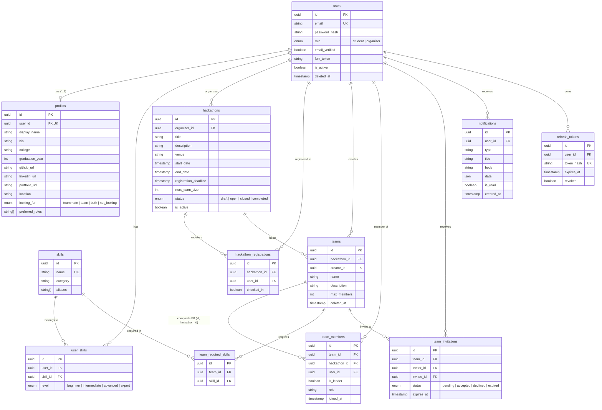

# SkillSync — Database ERD (12 Tables)

> Plan reference: `plan/01_DATABASE.md`
> Schema v2 Frozen Architecture

```mermaid
erDiagram
    users ||--o| profiles : "has (1:1)"
    users ||--o{ user_skills : "has"
    skills ||--o{ user_skills : "belongs to"
    users ||--o{ hackathons : "organizes"
    hackathons ||--o{ hackathon_registrations : "registers"
    users ||--o{ hackathon_registrations : "registered in"
    hackathons ||--o{ teams : "hosts"
    users ||--o{ teams : "creates"
    teams ||--o{ team_members : "composite FK (id, hackathon_id)"
    users ||--o{ team_members : "member of"
    teams ||--o{ team_required_skills : "requires"
    skills ||--o{ team_required_skills : "required in"
    teams ||--o{ team_invitations : "invites to"
    users ||--o{ team_invitations : "receives"
    users ||--o{ notifications : "receives"
    users ||--o{ refresh_tokens : "owns"

    users {
        uuid id PK
        string email UK
        string password_hash
        enum role "student | organizer"
        boolean email_verified
        string fcm_token
        boolean is_active
        timestamp deleted_at
    }

    profiles {
        uuid id PK
        uuid user_id FK, UK
        string display_name
        string bio
        string college
        int graduation_year
        string github_url
        string linkedin_url
        string portfolio_url
        string location
        enum looking_for "teammate | team | both | not_looking"
        string[] preferred_roles
    }

    skills {
        uuid id PK
        string name UK
        string category
        string[] aliases
    }

    user_skills {
        uuid id PK
        uuid user_id FK
        uuid skill_id FK
        enum level "beginner | intermediate | advanced | expert"
    }

    hackathons {
        uuid id PK
        uuid organizer_id FK
        string title
        string description
        string venue
        timestamp start_date
        timestamp end_date
        timestamp registration_deadline
        int max_team_size
        enum status "draft | open | closed | completed"
        boolean is_active
    }

    hackathon_registrations {
        uuid id PK
        uuid hackathon_id FK
        uuid user_id FK
        boolean checked_in
    }

    teams {
        uuid id PK
        uuid hackathon_id FK
        uuid creator_id FK
        string name
        string description
        int max_members
        timestamp deleted_at
    }

    team_required_skills {
        uuid id PK
        uuid team_id FK
        uuid skill_id FK
    }

    team_members {
        uuid id PK
        uuid team_id FK
        uuid hackathon_id FK
        uuid user_id FK
        boolean is_leader
        string role
        timestamp joined_at
    }

    team_invitations {
        uuid id PK
        uuid team_id FK
        uuid inviter_id FK
        uuid invitee_id FK
        enum status "pending | accepted | declined | expired"
        timestamp expires_at
    }

    notifications {
        uuid id PK
        uuid user_id FK
        string type
        string title
        string body
        json data
        boolean is_read
        timestamp created_at
    }

    refresh_tokens {
        uuid id PK
        uuid user_id FK
        string token_hash UK
        timestamp expires_at
        boolean revoked
    }
```
